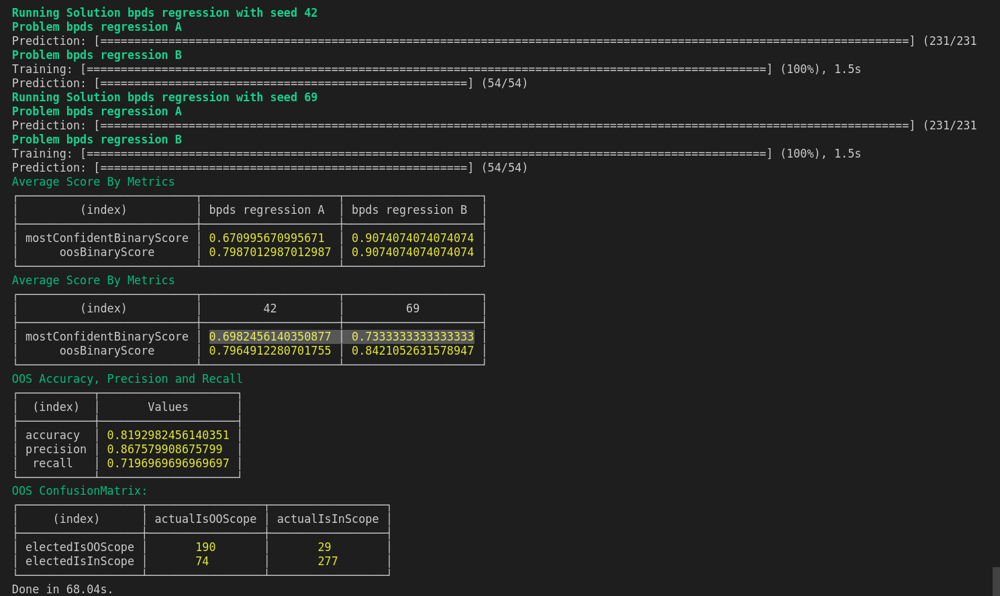

## BITFAN

**Botpress Independent Testing Framework for Algorithms of NLU**

Bitfan is a nodejs framework/ library that contains multiple builtin functions to benchmark Botpress NLU or any custom NLU implementation.



### Main Concepts

Bitfan allows the user to solve `Problems`:

```ts
interface Problem<T extends ProblemType> {
  name: string; // name of the problem for logging purposes
  type: T; // type of the problem
  trainSet: DataSet<T>;
  testSet: DataSet<T>;
  lang: string;
  cb: ProblemCb<T>; // cb func to visualize results of this problem
}
```

A problem is mostly defined by a `type`, a train set and a test set.

What are problem types? Problem types can refer to any of theses:

```ts
type ProblemType =
  | "intent-topic"
  | "topic"
  | "intent"
  | "multi-intent"
  | "slot"
  | "lang"
  | "spell";
```

For instance, a problem of type `Problem<"slot">` contains a train set and a test set of type `DataSet<"slot">`.

Two different problem types have different labels associated.

```ts
type Label<"Slot"> = { name: string, start: number, end: number }
type Label<"intent"> = string
type Label<"multi-intent"> = string[]
```

To try solving a `Problem`, a user must define a `Solution` and run his solution using the `runSolution` function.

```ts
interface Solution<T extends ProblemType> {
  name: string;
  problems: Problem<T>[];
  engine: Engine<T>; // actual classifier that solves problems of type T
  metrics: Metric<T>[]; // metric that outputs a score between 0 and 1 for a given test (row)
  cb: ProblemCb<T>; // cb func to visualize results of this solution
}

function runSolution<T extends ProblemType>(
  solution: Solution<T>,
  seeds: number[]
): Promise<Result<T>[]>; // returns results for all problems and all seeds
```

The `Engine` abstraction is also specific to one problem type. It stands for the actual classifier implementation that predicts a label for a given text input.

```ts
interface Engine<T extends ProblemType> {
  train: (trainSet: DataSet<T>, seed: number) => Promise<void>;
  predict: (testSet: DataSet<T>) => Promise<PredictOutput<T>[]>;
}
```

The `Criteria` abstraction act as a decision function that compute weither or not the test is failing or passing. It exists because engines are not responsible for electing a label.

```ts
interface Criteria<T extends ProblemType> {
  name: string;
  eval(res: Result<T>): number;
}
```

Bitfan is shipped with builtin `datasets`, `criterias`, `metrics`, `engine` and `visualisation` function, but any user is also free to implement his own custom code, and pass it to injections points.

Here's a full example:

```ts
import bitfan, { Problem, Solution } from "@botpress/bitfan";

type BpdsTopics = "A" | "B" | "C" | "D" | "E" | "F";

const makeProblem = (topic: BpdsTopics): Problem<"intent"> => {
  return {
    name: `bpds intents ${topic}`,
    type: "intent",
    trainSet: bitfan.datasets.bpds.intents.train[topic],
    testSet: bitfan.datasets.bpds.intents.test[topic],
    lang: "en",
  };
};

async function main() {
  console.log("BPDS intents");

  const allTopics: BpdsTopics[] = ["A", "B", "C", "D", "E", "F"];

  const criterias = [bitfan.criterias.labelIs];

  const problems = allTopics.map(makeProblem);

  const stanEndpoint = "http://localhost:3200";
  const password = "123456";
  const engine = bitfan.engines.makeBpIntentEngine(stanEndpoint, password);

  const solution: Solution<"intent"> = {
    name: "bpds regression",
    problems,
    engine,
    criterias,
  };

  const seeds = [42, 666];
  const results = await bitfan.runSolution(solution, seeds);

  bitfan.metrics.showAverageScores(results, { aggregateBy: "problem" });
  bitfan.metrics.showOOSPerformance(results, { aggregateBy: "problem" });
  bitfan.metrics.showAverageScores(results, { aggregateBy: "seed" });
  bitfan.metrics.showOOSPerformance(results, { aggregateBy: "seed" });
  bitfan.metrics.showOOSConfusion(results);
}
main().then(() => {});
```
